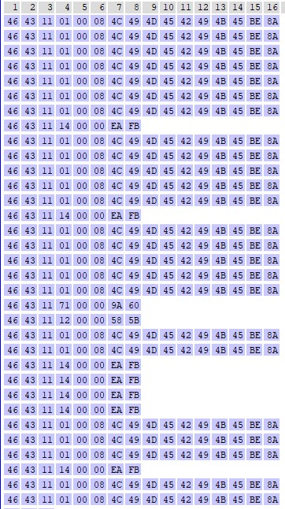
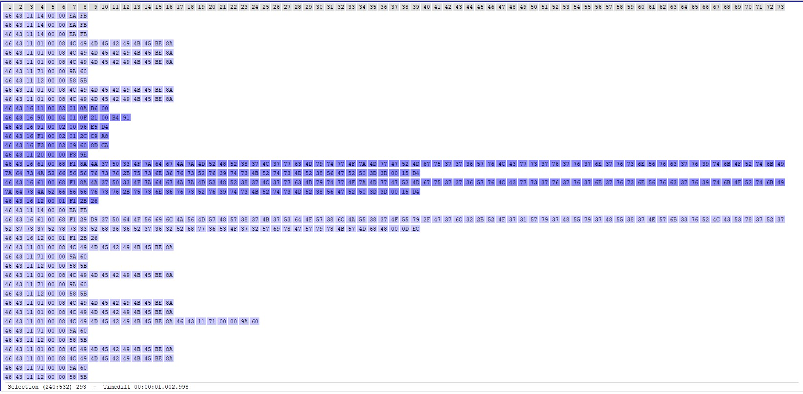

# Logs

This directory contains all logs I've captured with `HTerm`. You can find some analysis here as well.

**FW versions**: `1.9.0` & `2.4.xx` but both seem to behave the same way

### Short description

In `raw` directory you will find logs captured with HTerm in `raw` format.

JPEGs are the visual screenshots with selected log parts which are the most interesting.

`tx-unlock-lock-text.log` is converted file from HTerm's `raw` log and parsed in human-readable format. Each line is a complete command sent to controller. The whole log contains 1 unlock and 1 lock command.

## Screenshots

Those are all read commands sent to controller by green GPS box.

-----

This is a selected log part when scooter activation happens. Turn-on command is quite long here and seems to change under some conditions

## Quick note

I've turned the scooter twice successfully, but after sending the whole command sequence. But after those two times, it stopped to work.
